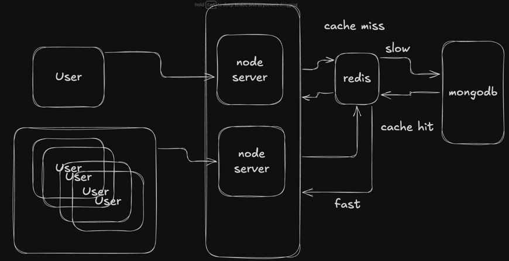
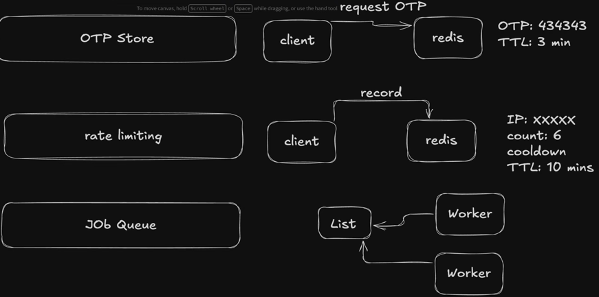

REDIS:

1. When to use Redis?
It is to be noted that redis is not the solution for every problem.
common checklist may include:
A. Read Pressure.
B. Temp data expire.
C. Shared Counter.
D. Background Jobs

2. When not to use Redis?
For sure, it should be used to control write pressure.

3. What are the drop in alternative to Redis?
A. KeyDB   B.Valkey    C. Dragonfly DB.  D. MemCached   E. Uptash

4. Working of Redis:

5. What are the different ways to use the Redis?

